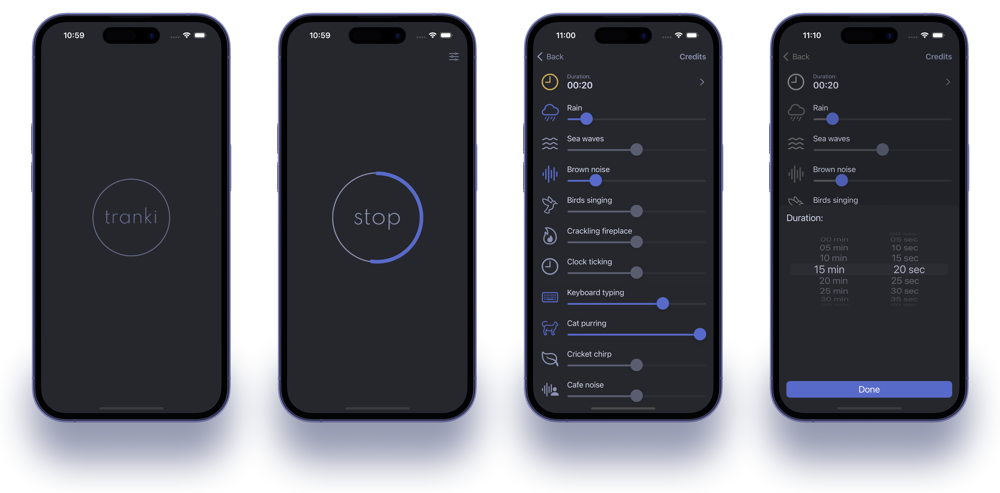
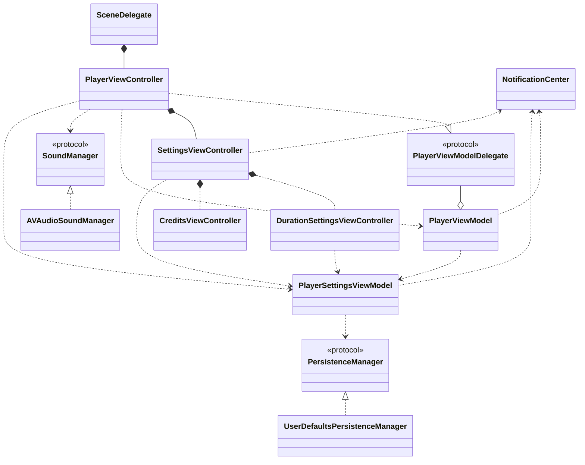

# tranki
## Overview

**tranki** is a straightforward mobile application designed to help users practice meditation without any distractions. Unlike many meditation apps that offer various premium features or additional content, this app focuses solely on providing a clean and intuitive interface for timing meditation sessions.

## Features
- **Basic Timer:** Set a timer for your meditation session with simple controls.
- **Sound Mixer:** Customize your meditation experience by mixing background sounds using a simple UI.
- **Minimalist Design:** Avoids clutter and unnecessary features to maintain a distraction-free environment.
- **Open Source:** This app is open source, meaning you can view and contribute to the code.

## Why This App?

This app was created with a specific philosophy in mind: simplicity and focus. It aims to provide a tool for meditation practice without upselling or promoting additional services. Whether you're a beginner or experienced meditator, you can use this app to enhance your meditation sessions without distractions.

## App architecture

## Contributing

Contributions are welcome! If you have any ideas for improvements or new features, feel free to fork the repository and submit a pull request.

## License

This project is licensed under the [MIT License](LICENSE.txt).